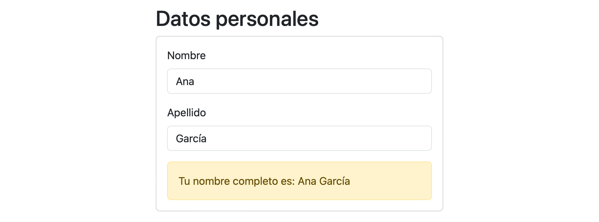
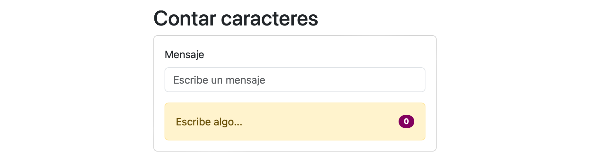
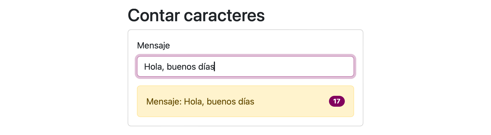
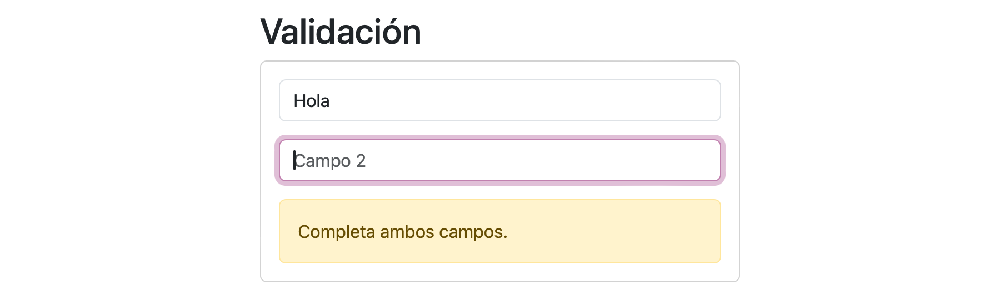
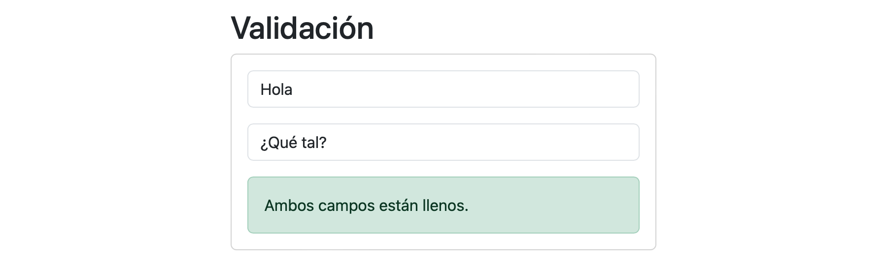
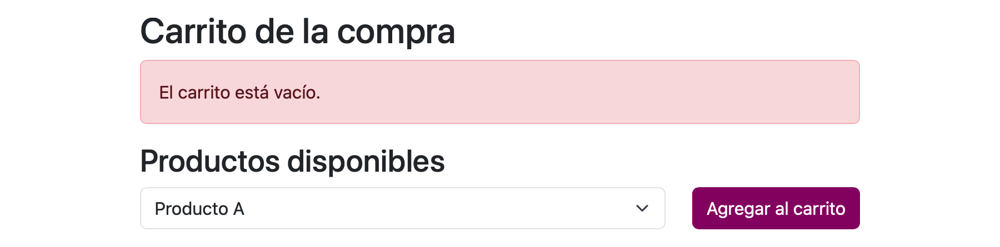
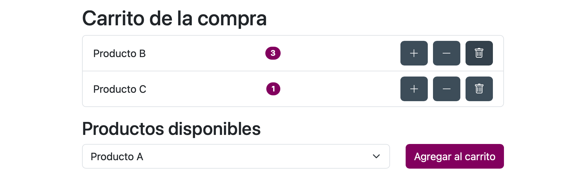

# Directivas

## 1

Crea un componente Vue con dos cajas de texto: en una nos escribirán un nombre y en la otra un apellido.

Se debe mostrar el nombre completo y actualizarse al teclear en cualquiera de las dos cajas.

## 2

Utiliza `v-bind` para unir el valor de `class`, de `style` y de `href` de forma dinámica a una cabecera, párrafo y
enlace respectivamente.

## 3

Desarrolla un componente que muestre lo que se está escribiendo en una caja de texto y que también indique el número de
caracteres.

## 4

Mostrar u ocultar un mensaje al hacer clic en un botón.

## 5

Mostrar los elementos de un array. Si no hay elementos deberá mostrar el mensaje _"No hay elementos"_.

## 6

Desarrolla un componente con dos cajas de texto:

- Si en las dos hay datos, aparecerá el mensaje _"Ambos campos estánllenos"_.
- Si no hay datos en ninguna o en alguna, aparecerá el mensaje _"Complete ambos campos"_.

## 7

Desarrolla un componente con dos botones:

- El primero incrementará el valor de un contador en una unidad.
- El segundo hará lo contrario, es decir, decrementará en una unidad el valor de un contador.
- El contador inicialmente estará a cero.
- Hay que mostrar un mensaje indicando si el contador es positivo, negativo o si está a cero.

## 8

Desarrolla un componente que muestre una lista de tareas:

- Las tareas pueden estar pendientes o completadas.
- Si una tarea está pendiente y hacemos doble clic sobre ella, pasará a estar completada.
- Si hacemos doble clic sobre un tarea completada, desaparecerá de la lista.

## 9

Desarrolla un componente que muestre una lista de mensajes:

- Junto a cada mensaje, aparecerá un botón que permita eliminarlo.
- Al hacer clic en el mensaje podremos editarlo.

## 10

Desarrolla un componente con una lista desplegable con el nombre de los productos que podemos añadir al carrito de la
compra:

- Al añadir un producto, aparecerá por defecto una unidad, pero dispondremos de dos botones para añadir o borrar
  unidades.
- También podremos eliminar el producto del carrito.

